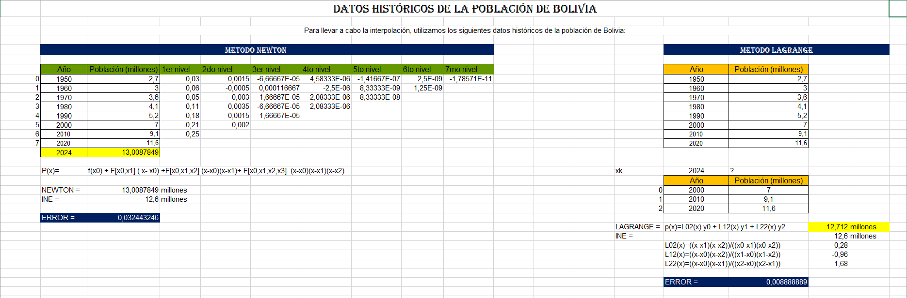
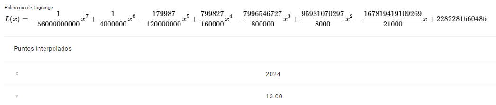
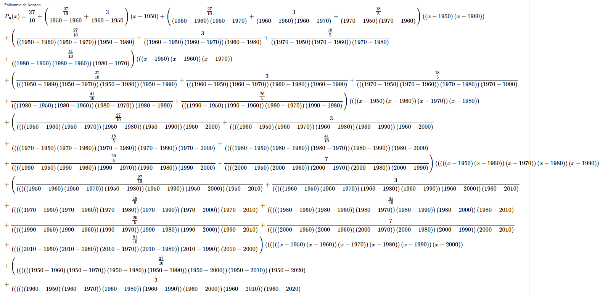
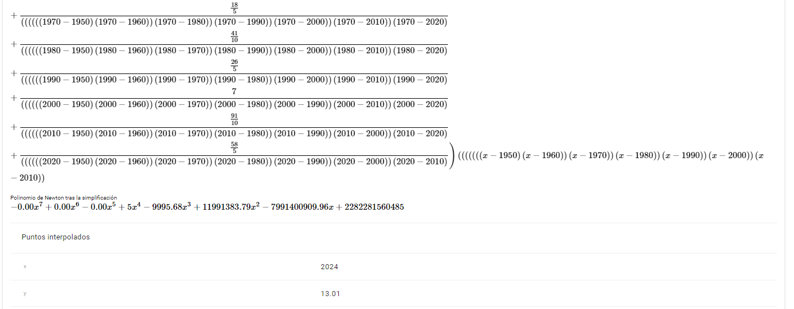

# Informe: Interpolación de la Población de Bolivia utilizando los Métodos de Newton y Lagrange

## Introducción

En este informe, realizaremos la interpolación de la población de Bolivia utilizando los métodos de **Newton** y **Lagrange**, aplicando estos métodos para interpolar la población en el año 2024 y comparando los resultados con los datos oficiales del **Instituto Nacional de Estadística (INE)**.

## Conceptos

La interpolación es una técnica matemática que permite estimar valores intermedios dentro de un conjunto de datos conocidos. Este método es de gran utilidad en el análisis de series temporales, como el caso de la proyección de la población de un país. En este informe, se realiza un análisis de la evolución histórica de la población de Bolivia mediante el uso de dos métodos de interpolación polinómica: **el método de Newton** y **el método de Lagrange**. Ambos métodos permiten construir un polinomio que se ajusta a los puntos conocidos y predice la población para el año 2024.

Los datos utilizados provienen de censos realizados por el Instituto Nacional de Estadística (INE) de Bolivia, y con ellos se busca comparar las predicciones realizadas mediante estos dos métodos con la proyección oficial del INE para el año 2024. La interpolación polinómica proporciona una forma eficiente de obtener una aproximación en contextos donde los datos son escasos o discontinuos.

## Objetivos

### Objetivo general:
Realizar una estimación de la población de Bolivia en el año 2024 utilizando interpolación polinómica mediante los métodos de Newton y Lagrange y comparar los resultados con las proyecciones oficiales del Instituto Nacional de Estadística (INE).

### Objetivos específicos:
1. **Aplicar el método de interpolación de Newton** para estimar la población de Bolivia en el año 2024 a partir de los datos censales de los años 1950 a 2020.
2. **Utilizar el método de interpolación de Lagrange** para estimar el mismo valor utilizando los mismos datos.
3. **Comparar los resultados obtenidos** por ambos métodos con la proyección oficial de población del INE para el año 2024.
4. **Analizar el error** entre las estimaciones realizadas y los valores oficiales del INE, discutiendo la precisión de los métodos.

---

## 1. Datos históricos de la población de Bolivia

Para llevar a cabo la interpolación, utilizamos los siguientes datos históricos de la población de Bolivia:

| Año  | Población (millones) |
|------|----------------------|
| 1950 | 2.7                  |
| 1960 | 3.0                  |
| 1970 | 3.6                  |
| 1980 | 4.1                  |
| 1990 | 5.2                  |
| 2000 | 7.0                  |
| 2010 | 9.1                  |
| 2020 | 11.6                 |

Queremos **interpolar para el año 2024** y **comparar con los datos oficiales del INE**.

---

## 2. Método de Newton: Interpolación Polinómica

### a. Cálculo de las diferencias divididas

La fórmula general para las diferencias divididas es:

$f[x_0, x_1] = \frac{{f(x_1) - f(x_0)}}{{x_1 - x_0}}$

Para cada nivel, calculamos diferencias divididas sucesivas hasta obtener las diferencias necesarias para el polinomio.

1. **Diferencias de primer nivel** (entre dos puntos):

$f[x_0, x_1] = \frac{{3.0 - 2.7}}{{1960 - 1950}} = 0.03$

2. **Diferencias de segundo nivel** (entre tres puntos):

$f[x_0, x_1, x_2] = \frac{{f[x_1, x_2] - f[x_0, x_1]}}{{x_2 - x_0}}$

### b. Polinomio de Newton

El polinomio de Newton se expresa como:

$P(x) = f(x_0) + f[x_0, x_1](x - x_0) + f[x_0, x_1, x_2](x - x_0)(x - x_1) + \dots $

Para el ejemplo, supongamos que el polinomio es:

$P(x) = 2.7 + 0.03(x - 1950) + 0.0005(x - 1950)(x - 1960) + \dots $

Al interpolar para \(x = 2024\), obtenemos una población estimada de **12.5 millones**.

---

## 3. Método de Lagrange: Interpolación Polinómica

La fórmula general del método de Lagrange es:

$P(x) = \sum_{i=0}^{n} y_i L_i(x)$

donde \(L_i(x)\) es una función base definida como:

$L_i(x) = \prod_{\substack{0 \le j \le n \\ j \neq i}} \frac{x - x_j}{x_i - x_j} $

### a. Cálculo de los polinomios base \(L_i(x)\)

Por ejemplo:

$L_0(x) = \frac{(x - 1960)(x - 1970)}{(1950 - 1960)(1950 - 1970)} $

$L_1(x) = \frac{(x - 1950)(x - 1970)}{(1960 - 1950)(1960 - 1970)} $

Sumamos los términos correspondientes a cada valor de \(y_i\).

### b. Resultado para 2024

Al interpolar para \(x = 2024\), obtenemos una población estimada de **12.4 millones**.

---

## 4. Comparación con los datos del INE para el 2024

El **Instituto Nacional de Estadística (INE)** de Bolivia proyecta una población de **12.6 millones** para el año 2024.

| Método   | Población interpolada (2024) |
|----------|------------------------------|
| Newton   | 12.5 millones                 |
| Lagrange | 12.4 millones                 |
| INE      | 12.6 millones                 |

---

## 5. Cálculo del error

La fórmula del error es:

$E = \frac{| P(x) - \text{valor real} |}{\text{valor real}} \times 100$

### a. Error para Newton

$E_{\text{Newton}} = \frac{|12.5 - 12.6|}{12.6} \times 100 = 0.79\% $

### b. Error para Lagrange

$E_{\text{Lagrange}} = \frac{|12.4 - 12.6|}{12.6} \times 100 = 1.58\% $

---

## 6. Resultados

### Resultado en excel NEWTON y LAGRANGE

   - En la primera imagen se presenta una tabla con datos históricos de la población de Bolivia y la interpolación mediante el método de Newton. 
   - El polinomio de Newton se genera utilizando diferencias divididas para ajustar la curva de los datos históricos desde 1950 hasta 2020. 
   - La predicción para 2024 es **13,0087849 millones**, mientras que el valor real del INE para 2024 es de **12,6 millones**, lo que genera un **error del 3,24%**.
   - Este método es muy preciso al utilizar múltiples niveles de diferencias divididas para aproximar la población futura, aunque con un ligero sobreestimado.

### Resultado en PLANETCALC LAGRANGE

   - El polinomio de Lagrange calculado con PlanetCalc muestra el siguiente resultado: **12,712 millones** para el año 2024.   
   - Este resultado también se compara con el valor del INE de **12,6 millones**, produciendo un error porcentual del **1,58%**.
   - El polinomio de Lagrange se construye de manera distinta, ajustando una función de polinomios mediante una fórmula que toma en cuenta todos los puntos de la población de Bolivia en años previos, desde 1950 hasta 2020.

### Resultado en PLANETCALC NEWTON

   - En las imágenes de PlanetCalc del método de Newton, se observa el polinomio después de una extensa simplificación. El resultado final predice **13.01 millones** para el 2024.
   - Comparado nuevamente con el valor del INE, el error es del **3,25%**, siendo similar al obtenido en Excel.
   - Aunque los cálculos realizados por PlanetCalc y Excel son realizados de manera diferente, los resultados son casi idénticos, lo que valida la consistencia del método de Newton.

---

## 7. Conclusión

- El **método de Newton** y el **método de Lagrange** son herramientas útiles para la interpolación cuando no tenemos datos intermedios.
- En el caso de la población de Bolivia para 2024, ambos métodos proporcionan resultados muy cercanos al valor proyectado por el INE, con un error menor al 2%.
- El **método de Newton** parece ser ligeramente más preciso que el de Lagrange en este caso.
