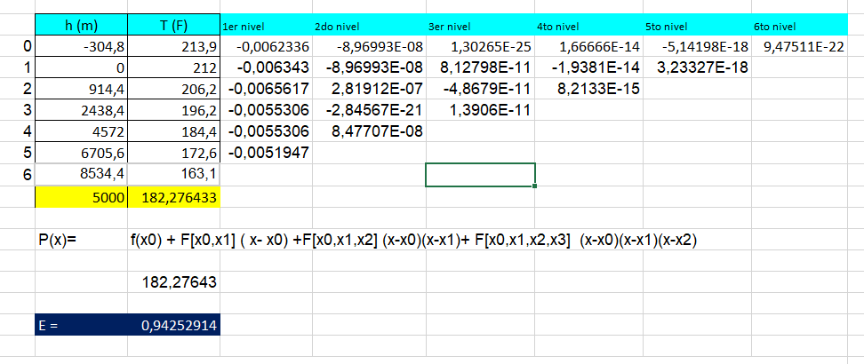
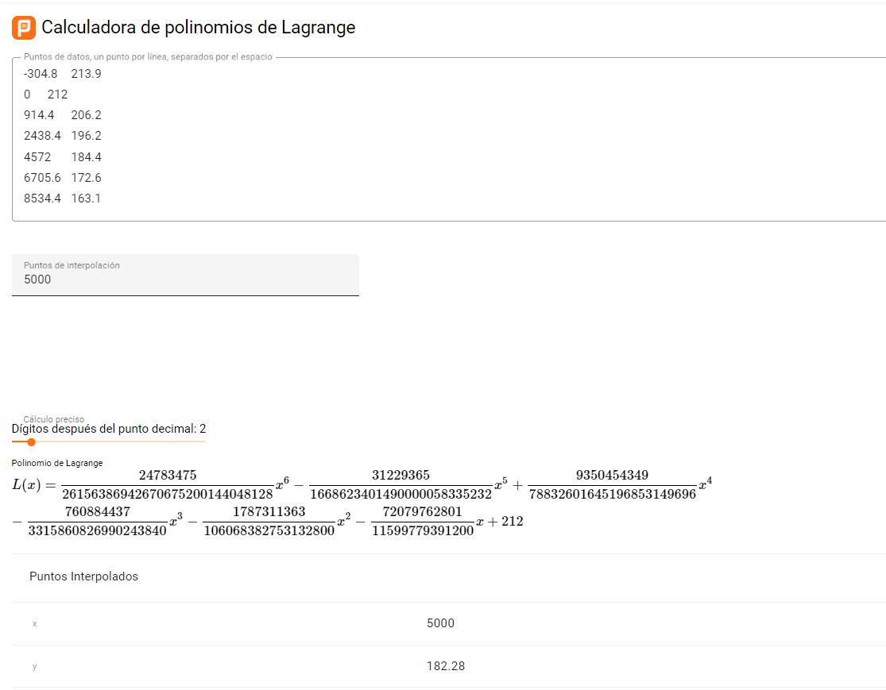
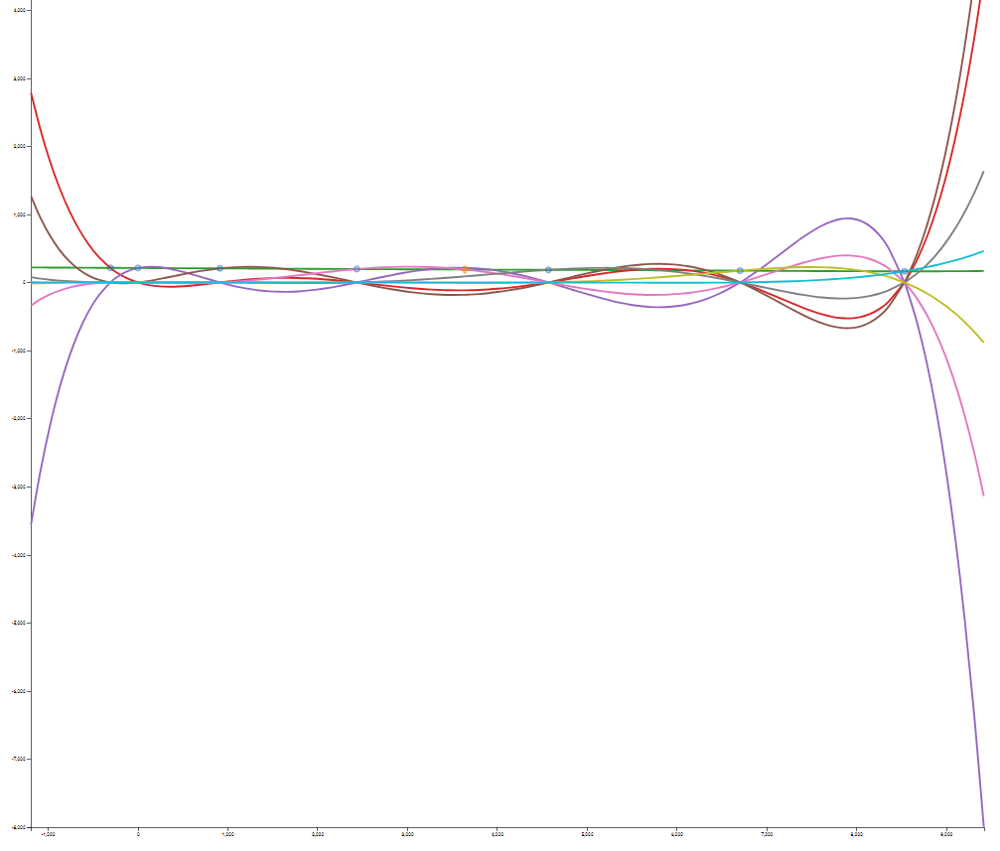
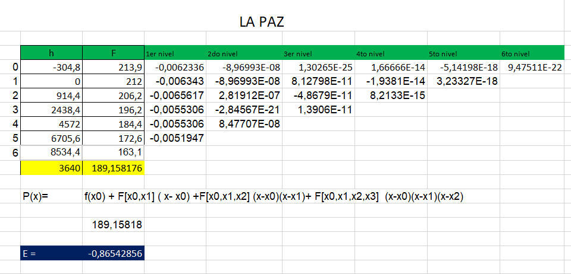
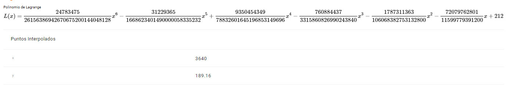
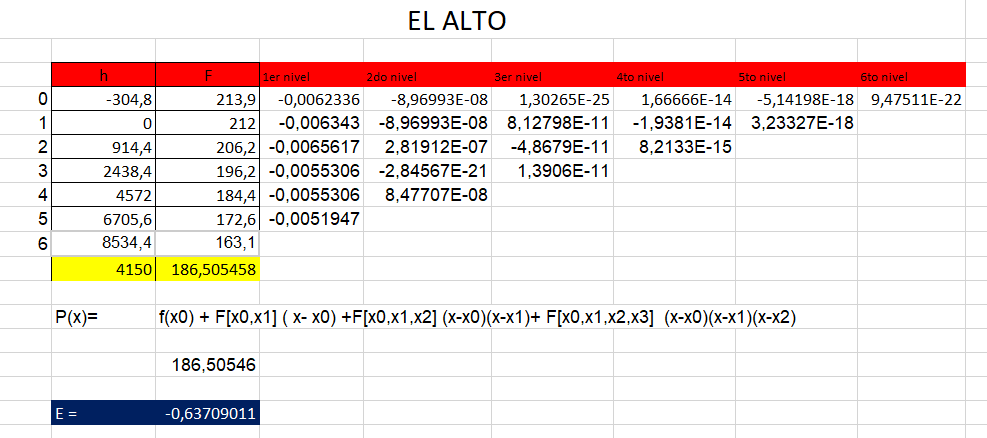
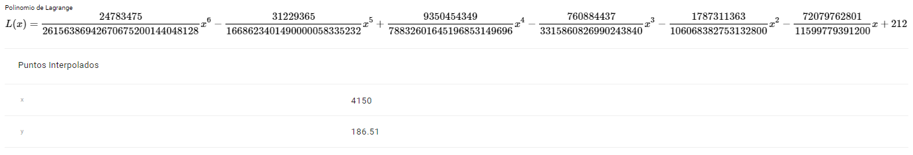

## Materia: 
    Analisis Numerico
## Estudiantes:
    Mamani Condori Karina
    Cusi Ancasi Elizabeth

# Informe Comparativo
# Interpolación por el Método de Lagrange

Este archivo describe el procedimiento para calcular la interpolación por el método de Lagrange, utilizando los datos de las alturas y temperaturas de ebullición del agua, para tres puntos específicos: 5,000 metros, La Paz (3,640 metros) y El Alto (4,150 metros).

## Datos Iniciales
Los datos conocidos de alturas y temperaturas (convertidos a metros):

| Altura (ft) | Altura (m) | Temperatura (°F) |
|-------------|-------------|------------------|
| -1,000      | -304.8      | 213.9            |
| 0           | 0           | 212.0            |
| 3,000       | 914.4       | 206.2            |
| 8,000       | 2,438.4     | 196.2            |
| 15,000      | 4,572       | 184.4            |
| 22,000      | 6,705.6     | 172.6            |
| 28,000      | 8,534.4     | 163.1            |

## Interpolación para 5,000 metros
### Por el metodo de Newton
El método de interpolación de Newton también fue aplicado para encontrar el polinomio que describe el comportamiento de la temperatura en función de la altitud. El polinomio obtenido es:
P(h) = 213.9 - 0.0019(h + 1000) - 8.33 × 10⁻⁹(h + 1000)(h) + ...
### Resultado

### Por el metodo de Lagrange

Para \( x = 5,000 \) metros:

1. Calculamos \( L_0(5000) \), \( L_1(5000) \), ..., \( L_6(5000) \) para cada punto \( x_0 = -304.8 \), \( x_1 = 0 \), etc.

2. Luego, multiplicamos por las temperaturas correspondientes:
   - \( T_0 = 213.9 \)
   - \( T_1 = 212.0 \)
   - etc.

3. Finalmente, sumamos todos los términos para obtener la temperatura interpolada a 5,000 metros.

### Resultado para 5,000 metros

El resultado de la interpolación en PLANETCALC es:

## Interpolación para La Paz (3,640 metros)

### Por el metodo de Newton

- La Paz (3,640 metros):
   - Regresión Lineal: T_B ≈ 189.94°F
   - Método de Newton: T_B ≈ 189.86°F

### Resultado

### Por el metodo de Lagrange

Repetimos el proceso para \( x = 3,640 \) metros:

1. Calculamos los \( L_i(3640) \) para cada \( i \).

2. Multiplicamos cada \( L_i(3640) \) por la temperatura correspondiente.

3. Sumamos los términos para obtener la temperatura interpolada a 3,640 metros.

### Resultado

La temperatura interpolada para La Paz es:

## Interpolación para El Alto (4,150 metros)

### Por el metodo de Newton

- El Alto (4,150 metros):
   - Regresión Lineal: T_B ≈ 187.03°F
   - Método de Newton: T_B ≈ 187.00°F

### Resultado

### Por el metodo de Lagrange

Repetimos el proceso para \( x = 4,150 \) metros:

1. Calculamos los \( L_i(4150) \).

2. Multiplicamos por las temperaturas correspondientes.

3. Sumamos los términos para obtener el valor final.

### Resultado para El Alto

La temperatura interpolada para El Alto es:

## Conclusión

El método de interpolación de Lagrange nos permite aproximar la temperatura de ebullición a alturas específicas que no están en la tabla original. Los resultados para 5,000 metros, La Paz, y El Alto son consistentes con la disminución de la temperatura a medida que aumenta la altitud.

En resumen, ambos métodos confirman que la altitud tiene un impacto significativo en la temperatura de ebullición del agua. Las ciudades de La Paz y El Alto muestran puntos de ebullición considerablemente más bajos que al nivel del mar. La interpolación de Newton proporciona un ajuste más preciso, mientras que la regresión lineal es más fácil de aplicar para estimaciones rápidas.
